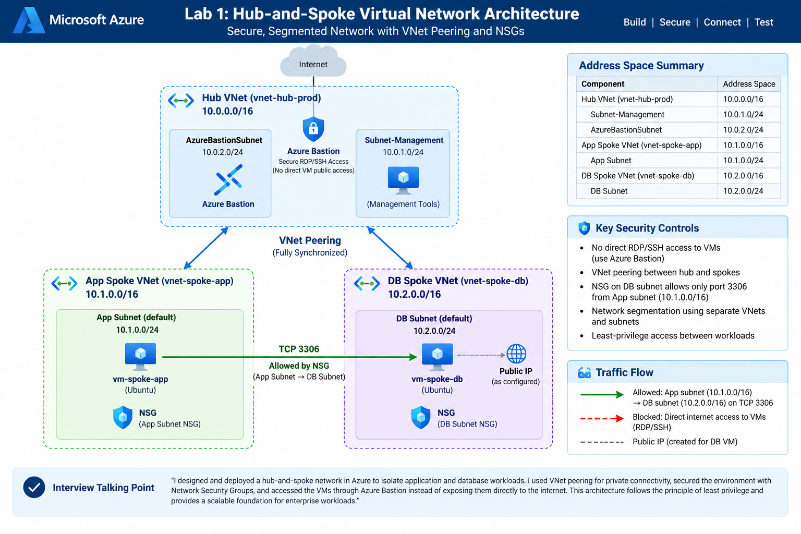
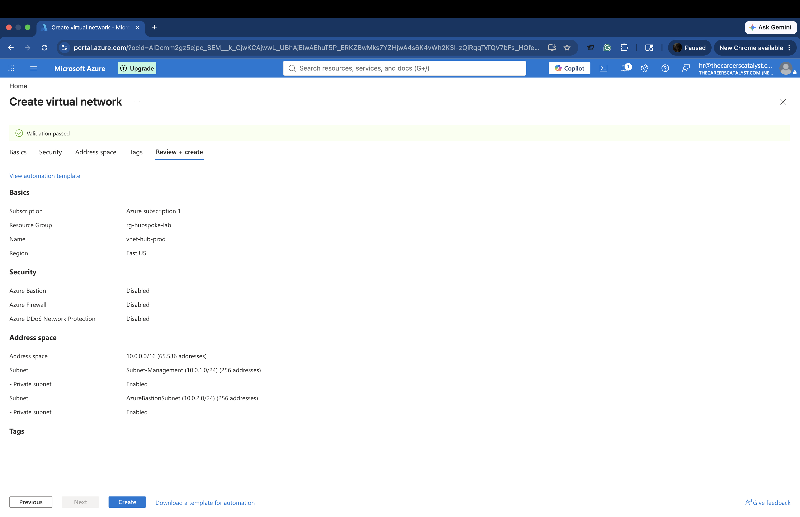
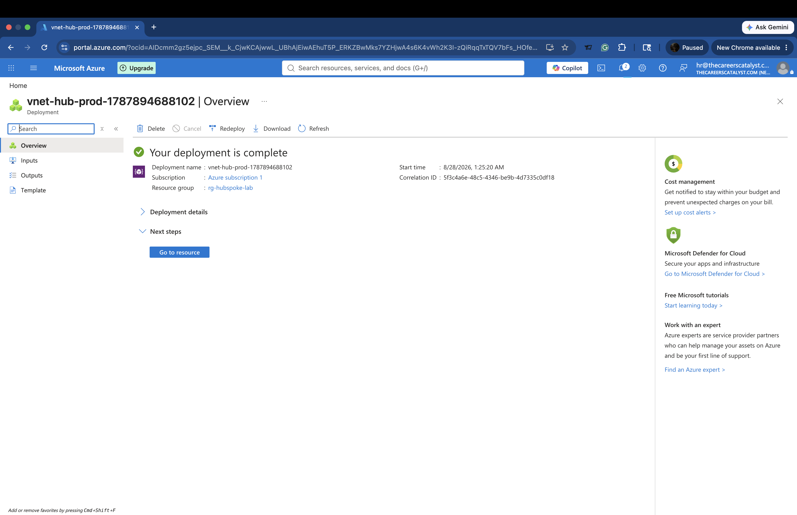
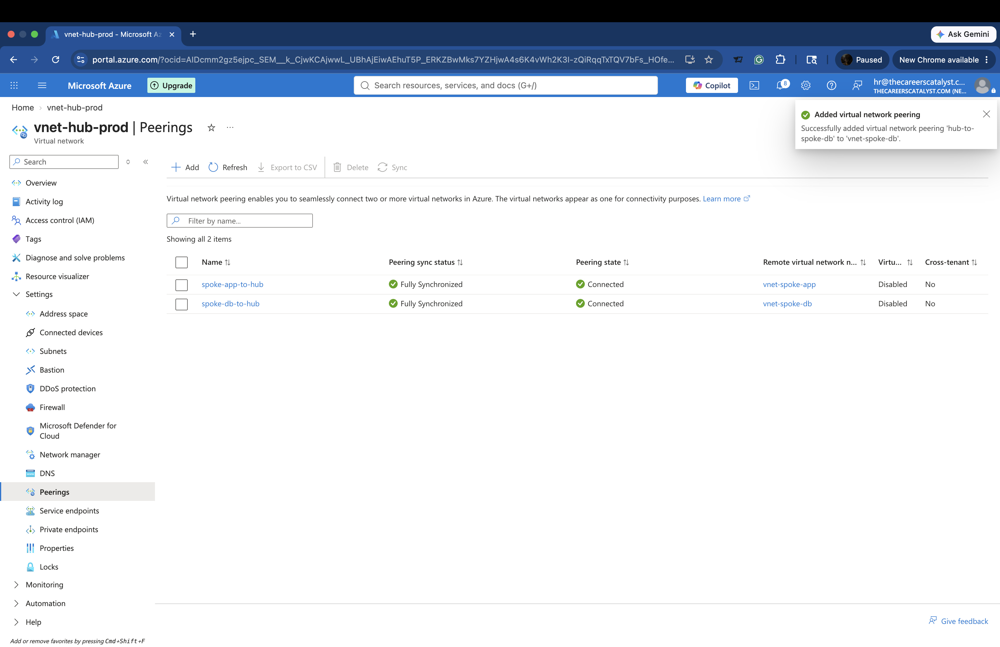
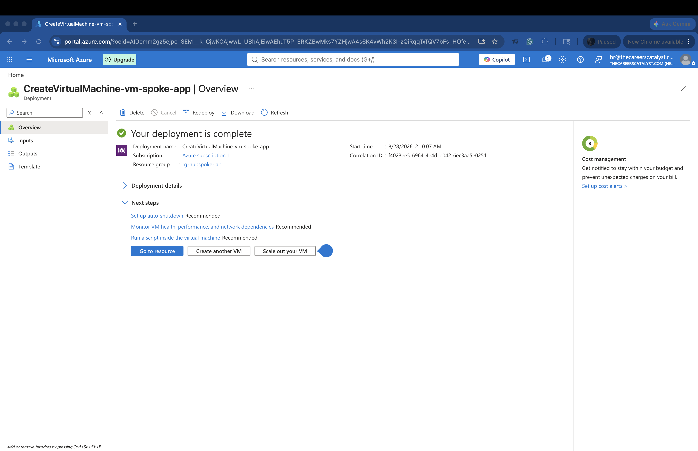
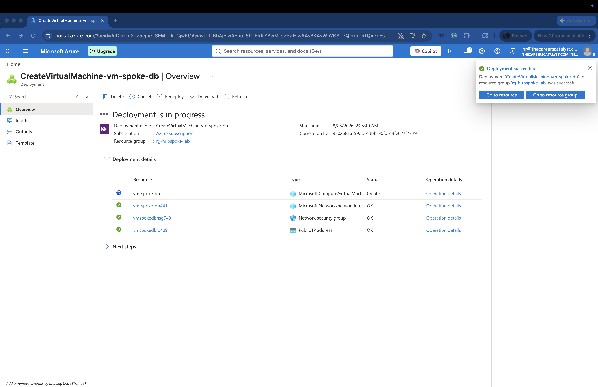
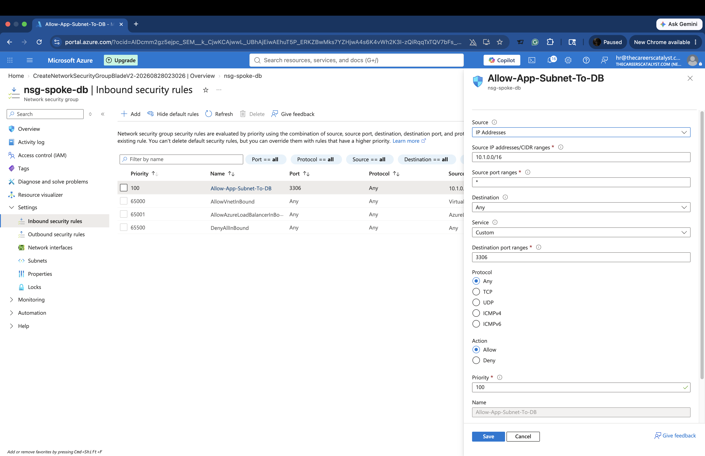
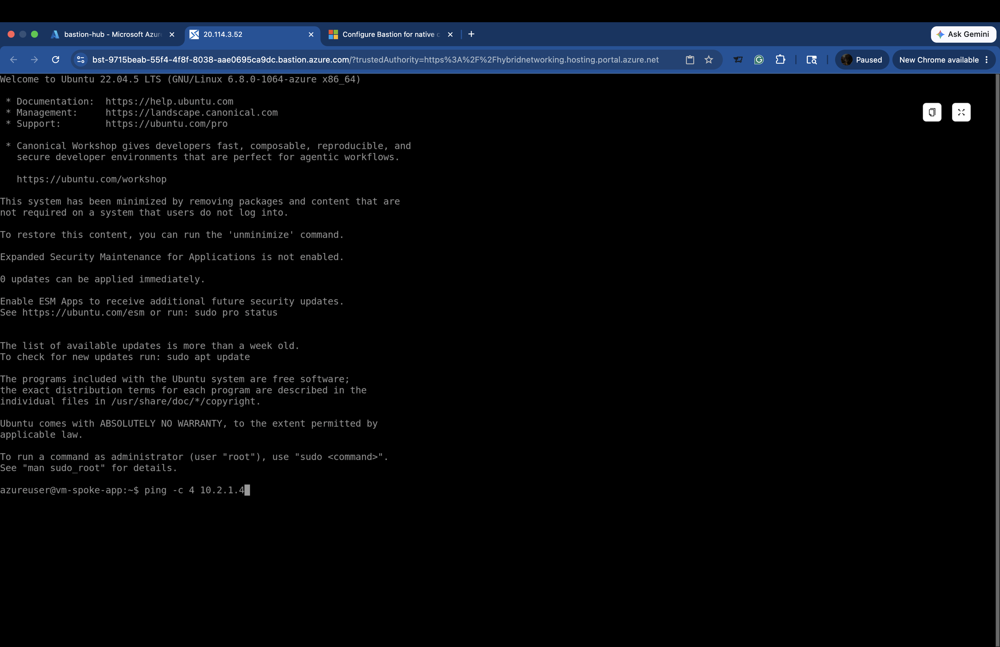
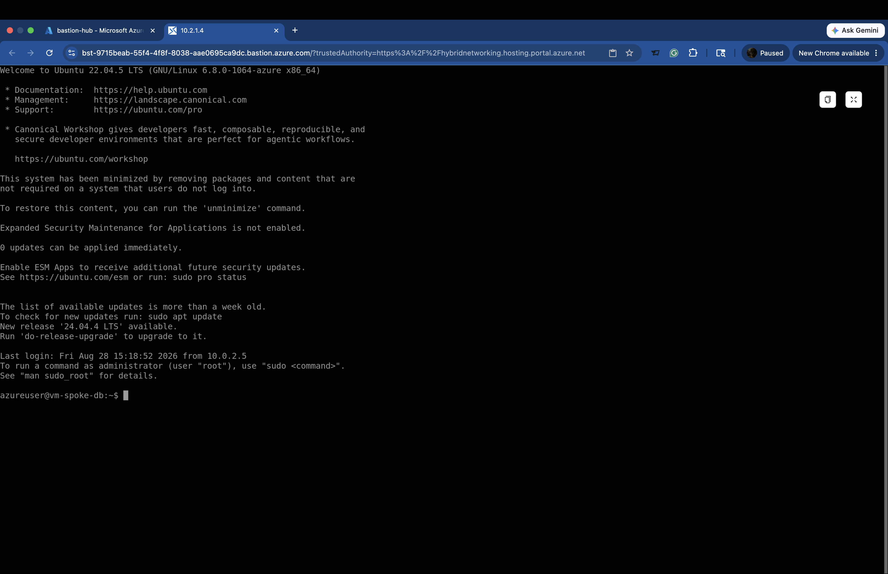

# Enterprise Hub-and-Spoke Virtual Network with VNet Peering & NSGs

## Project Overview

This project demonstrates the design and deployment of a hub-and-spoke network architecture in Microsoft Azure.

I created a centralized Hub Virtual Network and two separate Spoke Virtual Networks to isolate application and database workloads. The networks were connected using Azure VNet Peering, while Network Security Groups (NSGs) were used to control traffic between the workloads.

Azure Bastion was used to securely access the Linux virtual machines through the Azure Portal and perform private-network connectivity testing.

This lab provided hands-on experience with Azure networking, network segmentation, VNet peering, NSG rules, Azure Bastion, and workload isolation.

## Architecture

The environment consisted of:

- **Hub VNet:** `vnet-hub-prod` — `10.0.0.0/16`
- **Management Subnet:** `10.0.1.0/24`
- **AzureBastionSubnet:** `10.0.2.0/24`
- **Application Spoke VNet:** `vnet-spoke-app` — `10.1.0.0/16`
- **Database Spoke VNet:** `vnet-spoke-db` — `10.2.0.0/16`
- **Application VM:** `vm-spoke-app`
- **Database VM:** `vm-spoke-db`
- Hub-to-spoke VNet peering
- Network Security Groups (NSGs)
- Azure Bastion for administrative access
### Network Topology Diagram

The following diagram illustrates the hub-and-spoke network architecture, VNet peering relationships, workload segmentation, and NSG-controlled traffic between the application and database environments.

## Network Security Group (NSG) Rules

Network Security Groups were used to control traffic between the application and database workloads. The database NSG follows a least-privilege approach by allowing application-subnet traffic to the database service on port 3306.

### NSG Rules Matrix

| Priority | Rule | Source | Destination | Port | Protocol | Action | Purpose |
|---|---|---|---|---|---|---|---|
| 100 | Allow-App-Subnet-To-DB | `10.1.0.0/16` | Database workload | `3306` | Any | Allow | Allows the application network to communicate with the database service |
| 65000 | AllowVNetInBound | VirtualNetwork | VirtualNetwork | Any | Any | Allow | Azure default rule allowing traffic within the virtual network |
| 65001 | AllowAzureLoadBalancerInBound | AzureLoadBalancer | Any | Any | Any | Allow | Azure default load balancer rule |
| 65500 | DenyAllInBound | Any | Any | Any | Any | Deny | Azure default rule denying unmatched inbound traffic |

The custom `Allow-App-Subnet-To-DB` rule was configured with priority `100`, allowing traffic from the application VNet address space `10.1.0.0/16` to the database workload on port `3306`. All other unmatched inbound traffic is subject to the default NSG rules.

## Project Screenshots

The following screenshots document the Azure resources and configurations implemented during this lab.

### Hub Virtual Network Configuration

The Hub VNet was configured as `vnet-hub-prod` with the `10.0.0.0/16` address space and dedicated subnets for management and Azure Bastion.

### Hub VNet Deployment

The Hub Virtual Network deployment completed successfully in the `rg-hubspoke-lab` resource group.

### Hub-and-Spoke VNet Peering

Both spoke VNets were connected to the Hub VNet using VNet Peering. The Azure Portal shows both connections in a `Connected` and `Fully Synchronized` state.

### Application Virtual Machine

The application workload VM, `vm-spoke-app`, was successfully deployed.

### Database Virtual Machine

The database workload VM, `vm-spoke-db`, was deployed along with its associated networking resources.

### Database NSG Rule

A custom inbound NSG rule named `Allow-App-Subnet-To-DB` was configured with priority `100` to allow traffic from `10.1.0.0/16` to the database workload on port `3306`.

### Azure Bastion Connectivity Testing

Azure Bastion was used to access `vm-spoke-app` through a browser-based terminal. From the VM, private-IP connectivity testing toward the database workload was initiated.

### Database VM Bastion Session

Azure Bastion was also used to establish an administrative session with `vm-spoke-db`.

## Technologies and Azure Services Used

- Microsoft Azure
- Azure Virtual Networks (VNets)
- VNet Peering
- Azure Network Security Groups (NSGs)
- Azure Bastion
- Azure Virtual Machines
- Azure Subnets
- Private IP networking
- Hub-and-spoke network architecture
- Linux (Ubuntu)

## Security and Network Design

This lab applied several network security and segmentation concepts:

- Separate VNets were used to isolate application and database workloads.
- Hub-and-spoke architecture provided a centralized network design.
- VNet Peering provided connectivity between the Hub and Spoke VNets.
- Azure Bastion was used for browser-based administrative access to the Linux virtual machines.
- NSG rules were used to restrict and control workload traffic.
- Database traffic was limited with a custom rule allowing the application network to reach port `3306`.
- Default NSG rules provided additional protection for traffic that did not match explicitly allowed rules.

## Testing and Validation

The environment was validated by reviewing VNet peering status, confirming successful VM deployments, verifying the database NSG configuration, and establishing Azure Bastion sessions with the workload VMs.

Private-IP connectivity testing was also initiated from the application VM toward the database workload to evaluate communication across the network architecture.

## What I Learned

Through this project, I gained hands-on experience with:

- Designing a hub-and-spoke network topology in Azure
- Planning non-overlapping VNet and subnet address spaces
- Connecting isolated networks using VNet Peering
- Configuring Network Security Groups using least-privilege principles
- Controlling application-to-database traffic using ports and source address ranges
- Deploying Linux virtual machines into separate workload networks
- Using Azure Bastion for secure administrative access
- Testing and troubleshooting connectivity across Azure virtual networks

## Resource Cleanup

After completing and documenting the lab, the Azure resources were deleted to prevent unnecessary cloud charges. The screenshots in this repository preserve evidence of the original deployment and configuration.

## Interview Talking Point

> I designed and deployed a hub-and-spoke network architecture in Azure to separate application and database workloads. I connected the Hub and Spoke VNets using VNet Peering and configured Network Security Groups to control traffic between workloads. For the database environment, I created a least-privilege rule allowing traffic from the application network to port 3306. I also used Azure Bastion to establish administrative sessions with the Linux virtual machines and performed private-network connectivity testing. This project gave me practical experience with Azure network segmentation, peering, NSGs, Bastion, and connectivity troubleshooting.
